# Plot timelineR

The `plot_timeline` function in R helps visualize multi-variate 
time-series having numeric and state variables. The data used for
demonstration details the pollution levels in Delhi, which is downloaded from http://www.cpcb.gov.in/ .

In this package, the `futile:logger` package is used for logging since it provides 
a more granular control over the logging. This is useful to use the package in production
systems but you can treat the logs like normal R logs.

## Input data

For the package to work correctly, it expects the data to be structured in a specific way with a 
single timestamp column and one or more state and numeric variables. 

State variables are variables represented by `factor` or `character` columns, are categorical in nature.

Numeric variables are represented by `numeric` columns, are numeric and ordinal in nature.

Also, input data frame should have one column of the type `POSIXct` which represents the time of 
occurence of each observation. 


```r
library(dplyr, quietly = T)
```

```
## 
## Attaching package: 'dplyr'
```

```
## The following objects are masked from 'package:stats':
## 
##     filter, lag
```

```
## The following objects are masked from 'package:base':
## 
##     intersect, setdiff, setequal, union
```

```r
data_path <- system.file("extdata/delhi_air_pollution.csv", package = "timelineR")
air_pollution <- read.csv(data_path) %>% mutate(date = as.POSIXct(date)) %>% filter(date < as.POSIXct("2016-05-01"))
air_pollution$date = as.POSIXct(air_pollution$date)
str(air_pollution)
```

```
## 'data.frame':	139 obs. of  7 variables:
##  $ date    : POSIXct, format: "2015-12-01 05:30:00" "2015-12-02 05:30:00" ...
##  $ no      : num  93.6 144 62 182.9 410 ...
##  $ co      : num  2.62 3.02 2.1 3.5 6.24 5.7 4.48 5.82 3.7 3.74 ...
##  $ pm10    : num  358 423 432 506 509 ...
##  $ pm25    : num  200 208 224 321 550 ...
##  $ odd_even: chr  "NORMAL" "NORMAL" "NORMAL" "NORMAL" ...
##  $ day_type: chr  "WEEKDAY" "WEEKDAY" "WEEKDAY" "WEEKDAY" ...
```

## `plot_timeline`

### default plotting

The default configuration of the `plot_timeline` package plots univariate 
time series for all the variables in the order they appear 
in the data frame. It returns a `grob` object (`grid` package).


```r
require(timelineR)
plot_grob <- plot_timeline(air_pollution)
```

```
## INFO [2018-08-28 06:12:55] date has been selected as the timestamp column
## INFO [2018-08-28 06:12:55] no, co, pm10, pm25 has been selected as the numeric column(s)
## INFO [2018-08-28 06:12:55] odd_even, day_type has been selected as the state column(s)
## INFO [2018-08-28 06:12:55] creating state plot layers
## INFO [2018-08-28 06:12:55] creating sample plot layers
```

```
## Aligning plots
```

```
## Plotting
```

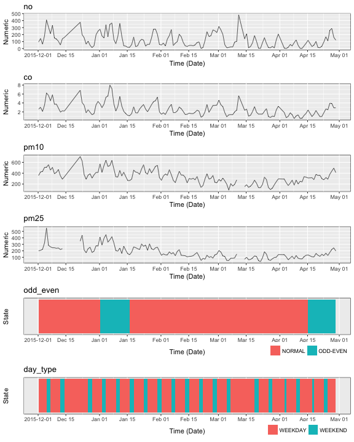

### Subset the variables to plot

The columns for which the data should be plotted can be subsetted 
by passing the names of the column in the argument `data_cols`. By default, 
the data for all the variables is plotted.


```r
data_cols = c("pm10", "no")
plot_grob <- plot_timeline(air_pollution, data_cols = data_cols)
```

```
## INFO [2018-08-28 06:12:58] date has been selected as the timestamp column
## INFO [2018-08-28 06:12:58] pm10, no has been selected as the numeric column(s)
## INFO [2018-08-28 06:12:58]  has been selected as the state column(s)
## INFO [2018-08-28 06:12:58] creating sample plot layers
```

```
## Aligning plots
```

```
## Plotting
```

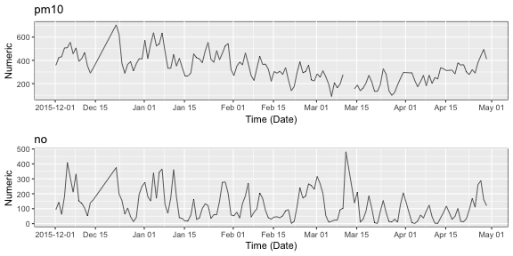

### Subset the time to plot

The time to plot can be subsetted by giving the start and the end times as values in the arguments `start_time` and `end_time` respectively.


```r
data_cols = c("pm10", "no")
start_time = as.POSIXct("2016-03-05")
end_time = as.POSIXct("2016-03-10")
plot_grob <- plot_timeline(air_pollution, data_cols = data_cols, start_time = start_time, end_time = end_time)
```

```
## INFO [2018-08-28 06:12:59] date has been selected as the timestamp column
## INFO [2018-08-28 06:12:59] pm10, no has been selected as the numeric column(s)
## INFO [2018-08-28 06:12:59]  has been selected as the state column(s)
## INFO [2018-08-28 06:12:59] creating sample plot layers
```

```
## Aligning plots
```

```
## Plotting
```

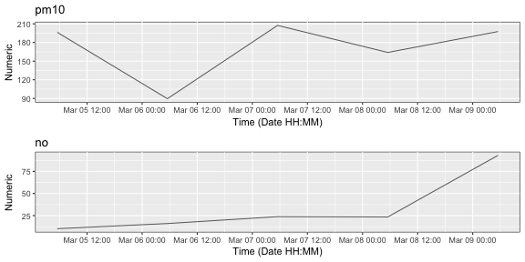

### Specify Y limits

The limit to plot on each axis can be passed as a named list with limits for the numeric plot


```r
data_cols = c("pm10", "no")
start_time = as.POSIXct("2016-03-05")
end_time = as.POSIXct("2016-03-10")
ylimits = list("pm10" = c(120,180))
plot_grob <- plot_timeline(air_pollution, data_cols = data_cols, start_time = start_time,
                           end_time = end_time, ylimits = ylimits)
```

```
## INFO [2018-08-28 06:13:00] date has been selected as the timestamp column
## INFO [2018-08-28 06:13:00] pm10, no has been selected as the numeric column(s)
## INFO [2018-08-28 06:13:00]  has been selected as the state column(s)
## INFO [2018-08-28 06:13:00] creating sample plot layers
```

```
## Aligning plots
```

```
## Plotting
```

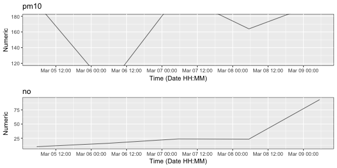


### Scale numeric variables

To bring multiple numeric variables to a comparable level, they can be scaled. The scaling information is passed as a named vector with name as the name of the column and value as its corresponding multiplication factor.


```r
data_cols = c("pm10", "no", "odd_even")
scale_vals = c("pm10" = 0.5, "no" = 2)
plot_grob <- plot_timeline(air_pollution, data_cols = data_cols, scale_vals = scale_vals)
```

```
## INFO [2018-08-28 06:13:01] date has been selected as the timestamp column
## INFO [2018-08-28 06:13:01] pm10, no has been selected as the numeric column(s)
## INFO [2018-08-28 06:13:01] odd_even has been selected as the state column(s)
## INFO [2018-08-28 06:13:01] Scaling data accoding to 'scale_vals'
## INFO [2018-08-28 06:13:01] creating state plot layers
## INFO [2018-08-28 06:13:01] creating sample plot layers
```

```
## Aligning plots
```

```
## Plotting
```

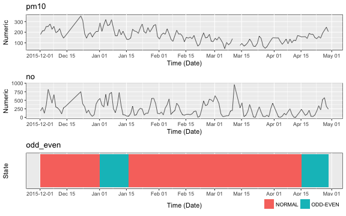


### Legend

For state variables, it can be specified if the legend is required or not. By default, the legends are shown


```r
data_cols = c("pm10", "odd_even")
plot_grob <- plot_timeline(air_pollution, data_cols = data_cols, add_legend = F)
```

```
## INFO [2018-08-28 06:13:03] date has been selected as the timestamp column
## INFO [2018-08-28 06:13:03] pm10 has been selected as the numeric column(s)
## INFO [2018-08-28 06:13:03] odd_even has been selected as the state column(s)
## INFO [2018-08-28 06:13:03] creating state plot layers
## INFO [2018-08-28 06:13:03] creating sample plot layers
```

```
## Aligning plots
```

```
## Plotting
```

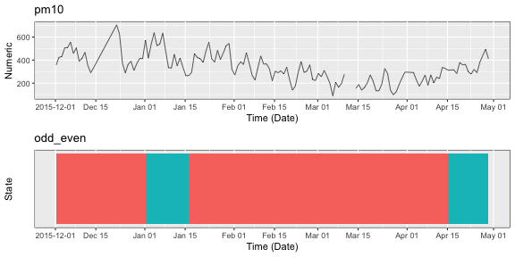


### Color mapping

For changing the fill color values for the plot of state variables, a color mapping can be passed. Color mapping can be defined for one or more state variables. However for a given state variable, mapping should be defined for all the possible states in that variable.

The package internally uses the ggplot package and accepts color input in the format supported by `ggplot`


```r
data_cols = c("odd_even")
color_mapping = list("odd_even" = c("NORMAL" = "#E67E22", "ODD-EVEN" = "green4"))
plot_grob <- plot_timeline(air_pollution, data_cols = data_cols, color_mapping = color_mapping)
```

```
## INFO [2018-08-28 06:13:04] date has been selected as the timestamp column
## INFO [2018-08-28 06:13:04]  has been selected as the numeric column(s)
## INFO [2018-08-28 06:13:04] odd_even has been selected as the state column(s)
## INFO [2018-08-28 06:13:04] creating state plot layers
```

```
## Aligning plots
```

```
## Plotting
```

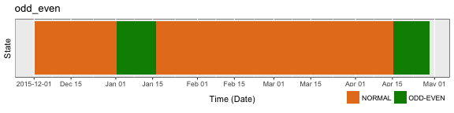


### Numeric plot type

The time series for data of numeric variables can be plotted in three ways:

* Line plot
* Step plot
* Point plot

The type of plot can be specified in the argument `numeric_plot_type`. Only three types are supported, hence the value for this argument should be one of `line`, `step` or `point`. By default, the plot type is `line`.


```r
data_cols = c("pm10")
plot_grob <- plot_timeline(air_pollution, data_cols = data_cols, numeric_plot_type = "step")
```

```
## INFO [2018-08-28 06:13:04] date has been selected as the timestamp column
## INFO [2018-08-28 06:13:04] pm10 has been selected as the numeric column(s)
## INFO [2018-08-28 06:13:04]  has been selected as the state column(s)
## INFO [2018-08-28 06:13:04] creating sample plot layers
```

```
## Aligning plots
```

```
## Plotting
```

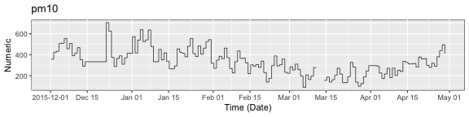


```r
data_cols = c("co")
plot_grob <- plot_timeline(air_pollution, data_cols = data_cols, numeric_plot_type = "point")
```

```
## INFO [2018-08-28 06:13:05] date has been selected as the timestamp column
## INFO [2018-08-28 06:13:05] co has been selected as the numeric column(s)
## INFO [2018-08-28 06:13:05]  has been selected as the state column(s)
## INFO [2018-08-28 06:13:05] creating sample plot layers
```

```
## Aligning plots
```

```
## Plotting
```

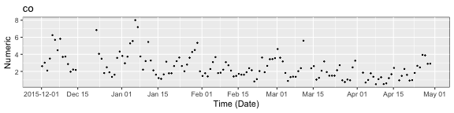


### Labeling the Y axis

By default, the label on Y-axis for the state and numeric plot is `State` and `Numeric` respectively. This can be changed by passing a name vector with names being the names of the plots and values as the name of the label.


```r
data_cols = c("co", "pm25", "odd_even")
ylabels = c("pm25" = "concentration", "odd_even" = "day type")
plot_grob <- plot_timeline(air_pollution, data_cols = data_cols, ylabels = ylabels)
```

```
## INFO [2018-08-28 06:13:06] date has been selected as the timestamp column
## INFO [2018-08-28 06:13:06] co, pm25 has been selected as the numeric column(s)
## INFO [2018-08-28 06:13:06] odd_even has been selected as the state column(s)
## INFO [2018-08-28 06:13:06] creating state plot layers
## INFO [2018-08-28 06:13:06] creating sample plot layers
## INFO [2018-08-28 06:13:06] Adding new y-labels
```

```
## Aligning plots
```

```
## Plotting
```

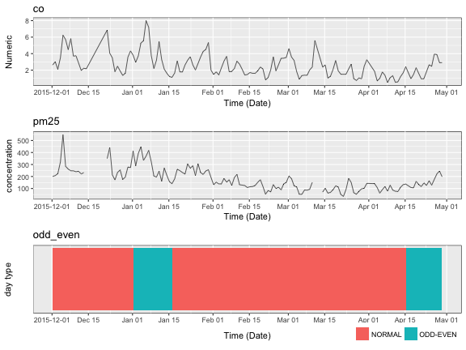


### Option to show the plot

Many times it is required to not show the output of the current function. In that case, the plot can be drawn by passing the `plot_output` argument as `FALSE`. By default, the plot is drawn.


```r
data_cols = c("co", "pm25", "odd_even")
ylabels = c("pm25" = "concentration", "odd_even" = "day type")
plot_grob <- plot_timeline(air_pollution, data_cols = data_cols, ylabels = ylabels, plot_output = F)
```

```
## INFO [2018-08-28 06:13:07] date has been selected as the timestamp column
## INFO [2018-08-28 06:13:07] co, pm25 has been selected as the numeric column(s)
## INFO [2018-08-28 06:13:07] odd_even has been selected as the state column(s)
## INFO [2018-08-28 06:13:07] creating state plot layers
## INFO [2018-08-28 06:13:07] creating sample plot layers
## INFO [2018-08-28 06:13:07] Adding new y-labels
```

```
## Aligning plots
```


### Overlapping plots

In time series data visualization, many times it is required to study the relation between a state variable and a numeric variable. For this, with the help of `plot_timeline`, it is possible to overlap the plot of numeric variable on that of a state variable.

To draw overlapping plots, a named list of vector is passed. Each name in the list is the name of the overlapping plot. Each element in the list is a vector of two elements with the first element as the name of the state variable and the second variable as the name of the numeric variable. Both the variables should be present in the `data_cols`.


```r
data_cols = c("pm25", "odd_even")
overlapping_plot_names = list("pm25_with_odd_even" = c("odd_even", "pm25"))
plot_grob <- plot_timeline(air_pollution, data_cols = data_cols, overlap_plots_names = overlapping_plot_names)
```

```
## INFO [2018-08-28 06:13:08] date has been selected as the timestamp column
## INFO [2018-08-28 06:13:08] pm25 has been selected as the numeric column(s)
## INFO [2018-08-28 06:13:08] odd_even has been selected as the state column(s)
## INFO [2018-08-28 06:13:08] creating state plot layers
## INFO [2018-08-28 06:13:08] creating sample plot layers
```

```
## Aligning plots
```

```
## Plotting
```

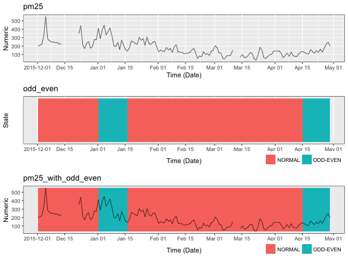


### Assigning titles to the plots

Each plot can be assigned a title. By default the title is the name of the variable for univariate plots and the name of the plot for the overlapping plots. The information is passed as a named vector with names as the name of the plot and value as the name of the title.


```r
data_cols = c("pm25", "odd_even")
titles = c("pm25" = "Concentration of particulate 2.5 matter", "pm25_with_odd_even" = "Study of concentration of PM 2.5 matter with odd-even policy")
overlapping_plot_names = list("pm25_with_odd_even" = c("odd_even", "pm25"))
plot_grob <- plot_timeline(air_pollution, data_cols = data_cols, overlap_plots_names = overlapping_plot_names, titles = titles)
```

```
## INFO [2018-08-28 06:13:10] date has been selected as the timestamp column
## INFO [2018-08-28 06:13:10] pm25 has been selected as the numeric column(s)
## INFO [2018-08-28 06:13:10] odd_even has been selected as the state column(s)
## INFO [2018-08-28 06:13:10] creating state plot layers
## INFO [2018-08-28 06:13:10] creating sample plot layers
## INFO [2018-08-28 06:13:10] Adding new plot titles
```

```
## Aligning plots
```

```
## Plotting
```

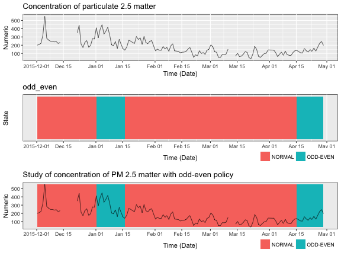


### Ordering the plots

While visualizing data, it is preferred to have plots arranged in a required order for better understanding. The order is specified as a vector with the names of variables and overlapping plots arranged in the required order. Only the plots given in the argument `order_plot` are drawn.

By default the plots for univariate variables are arranged in the order they appear in the data frame followed by the overlapping plots.


```r
data_cols = c("pm25", "odd_even")
titles = c("pm25" = "Concentration of particulate 2.5 matter", "pm25_with_odd_even" = "Study of concentration of PM 2.5 matter with odd-even policy")
overlapping_plot_names = list("pm25_with_odd_even" = c("odd_even", "pm25"))
order_plots = c("pm25_with_odd_even", "pm25")
plot_grob <- plot_timeline(air_pollution, data_cols = data_cols, overlap_plots_names = overlapping_plot_names, titles = titles, order_plots = order_plots)
```

```
## INFO [2018-08-28 06:13:11] date has been selected as the timestamp column
## INFO [2018-08-28 06:13:11] pm25 has been selected as the numeric column(s)
## INFO [2018-08-28 06:13:11] odd_even has been selected as the state column(s)
## INFO [2018-08-28 06:13:11] creating state plot layers
## INFO [2018-08-28 06:13:11] creating sample plot layers
## INFO [2018-08-28 06:13:11] Adding new plot titles
```

```
## Aligning plots
```

```
## Plotting
```

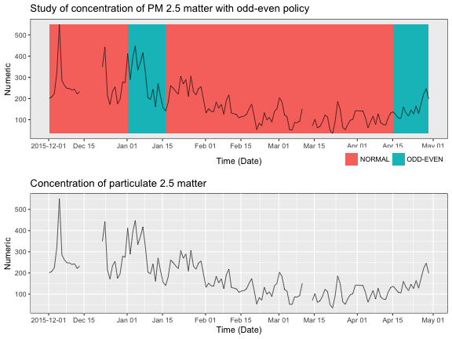


### Relative size of the plots

To emphasie on some of the plots, the relative size of the plots can be adjusted. The relative sizes are passed as a named vector with tha name as the name of the plot and value as the relative ratio. By default each plot has relative size of 1.


```r
data_cols = c("pm25", "odd_even")
titles = c("pm25" = "Concentration of particulate 2.5 matter", "pm25_with_odd_even" = "Study of concentration of PM 2.5 matter with odd-even policy")
overlapping_plot_names = list("pm25_with_odd_even" = c("odd_even", "pm25"))
plot_size_ratios = c("pm25_with_odd_even" = 2, "odd_even" = 0.5)
plot_grob <- plot_timeline(air_pollution, data_cols = data_cols, overlap_plots_names = overlapping_plot_names, titles = titles, plot_size_ratios = plot_size_ratios)
```

```
## INFO [2018-08-28 06:13:13] date has been selected as the timestamp column
## INFO [2018-08-28 06:13:13] pm25 has been selected as the numeric column(s)
## INFO [2018-08-28 06:13:13] odd_even has been selected as the state column(s)
## INFO [2018-08-28 06:13:13] creating state plot layers
## INFO [2018-08-28 06:13:13] creating sample plot layers
## INFO [2018-08-28 06:13:13] Adding new plot titles
```

```
## Aligning plots
```

```
## Plotting
```


### Saving the plots

It is possible to save the plot from the function. The name to be saved is passed as `save_path` argument. Only PNG format is supported.


# Auxiliary data helper function

To ease the procedure of extracting required names which are passed as arguments in the `plot_timeline` function, a helper function `match_grep` based on regular expression is provided for the same.


```r
data_path <- system.file("extdata/test_data.csv", package = "timelineR")
test_data <- read.csv(data_path)
test_data %>% str
```

```
## 'data.frame':	6 obs. of  5 variables:
##  $ start_time: chr  "2017-01-01 00:00:10" "2017-01-01 00:00:30" "2017-01-01 00:00:21" "2017-01-01 00:00:07" ...
##  $ state_1   : chr  "A" "A" "B" "B" ...
##  $ state_2   : chr  "User1" "User1" "User1" "User2" ...
##  $ num_1     : int  1 2 3 4 3 2
##  $ num_2     : int  200 250 529 1230 123 12
```

## `match_grep`

The first argument `grep_vec` is the named vector which is to be searched. The second vector `actual_names` is the vector in which the search is to be named. A named vector is returned with the names as the matched names and values given in `grep_vec`.


```r
grep_vec = c("state" = 1, "num" = 2)
match_grep(grep_vec, names(test_data))
```

```
## state_1 state_2   num_1   num_2 
##       1       1       2       2
```

### Un named `grep_vec`

If it is required to search the values given in a vector then the argument `use_values` should be set as `TRUE`.


```r
grep_vec = c("state" , "num")
match_grep(grep_vec, names(test_data), use_values = T)
```

```
## state_1 state_2   num_1   num_2 
## "state" "state"   "num"   "num"
```

### Return the names

To return just the matched values from `actual_names` instead of the named vector, pass the argument `return_names` as `TRUE`.


```r
grep_vec = c("state" , "num")
match_grep(grep_vec, names(test_data), use_values = T, return_names = T)
```

```
## [1] "state_1" "state_2" "num_1"   "num_2"
```

### Show information of matched and unmatched names

To show for each value searched, what values in `actual_names` matched or not, the argument `echo` can be set to `TRUE`.


```r
grep_vec = c("state" , "num")
match_grep(grep_vec, names(test_data), use_values = T, return_names = T, echo = T)
```

```
## INFO [2018-08-28 06:13:15] No matches found for start_time
```

```
## [1] "state_1" "state_2" "num_1"   "num_2"
```
